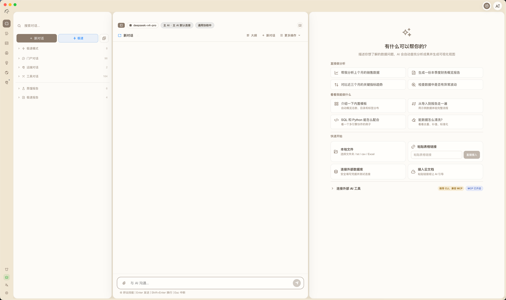
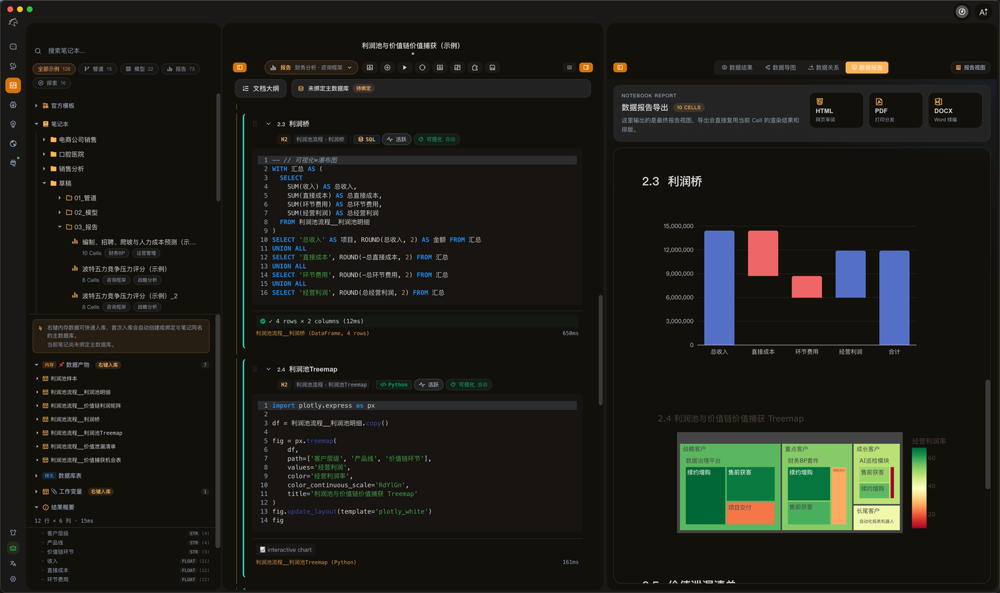
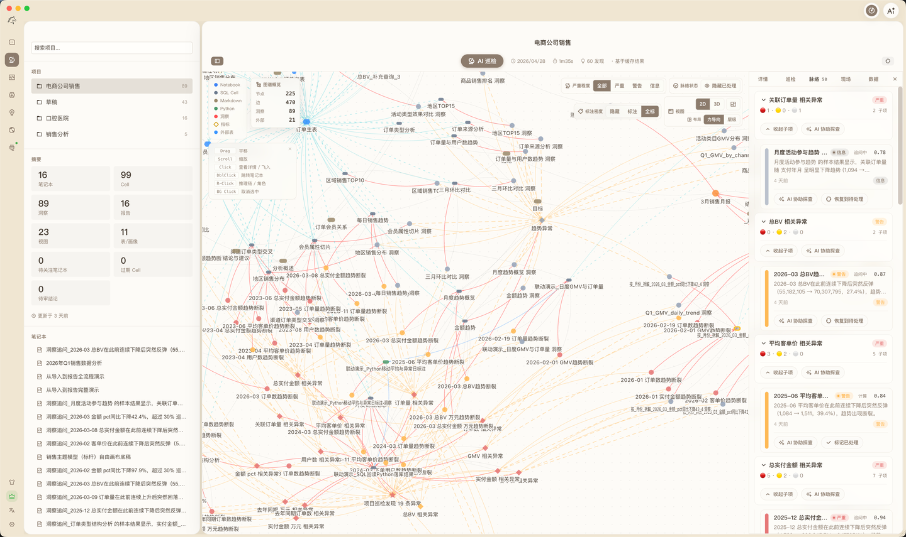

  <a href="./README.md">简体中文</a> |
  <a href="./README.zh-TW.md">繁體中文</a> |
  <a href="./README.en.md">English</a> |
  <a href="./README.ja.md">日本語</a> |
  <a href="./README.ko.md">한국어</a> |
  <a href="./README.es.md">Español</a> |
  <a href="./README.fr.md">Français</a> |
  <a href="./README.de.md">Deutsch</a> |
  <a href="./README.ru.md">Русский</a> |
  <a href="./README.pt-BR.md">Português</a> |
  <a href="./README.ar.md">العربية</a> |
  <a href="./README.hi.md">हिन्दी</a> |
  <a href="./README.id.md">Bahasa Indonesia</a> |
  <a href="./README.th.md">ไทย</a> |
  <a href="./README.vi.md">Tiếng Việt</a> |
  <a href="./README.tr.md">Türkçe</a> |
  <a href="./README.pl.md">Polski</a> |
  <a href="./README.he.md">עברית</a>

# SanchoExo

**स्थानीय एआई डेटा ऑपरेटिंग रूम (Local AI Data Operating Room)**

निष्पादन योग्य टेम्प्लेट, बुद्धिमान एआई, DuckDB OLAP, ऑडिट करने योग्य सेल, संरचित दृश्य भाषाओं और निरीक्षण फ्लाईव्हील को एक परिष्कृत और सुरक्षित डेस्कटॉप सॉफ़्टवेयर में एकीकृत करें, जिससे डेटा विश्लेषण स्थानीय रूप से अपने प्रदर्शन को उजागर कर सके।

[आधिकारिक वेबसाइट (sanchoexo.com)](https://sanchoexo.com) · [डाउनलोड](#डाउनलोड) · [विशेषताएं](#चैटबॉक्स-की-सीमाओं-को-तोड़ना-स्थानीय-डेटा-विश्लेषण-को-नया-आकार-देना) · [प्रतिक्रिया](https://github.com/jiangnanquan/SanchoExo/issues)

---

## गीक के मुख्य सिद्धांत

- **100% स्थानीय भंडारण (गोपनीयता गीक)** — डेटा आपकी स्थानीय मशीन को कभी नहीं छोड़ता है। हम आपकी गोपनीयता और गोपनीय सुरक्षा के लिए जिम्मेदार हैं, एक बिल्कुल सुरक्षित व्यक्तिगत डेटा किला बनाते हैं।
- **शून्य कॉन्फ़िगरेशन, आउट ऑफ द बॉक्स (परिनियोजन अनुभव)** — जटिल परिनियोजन सेवाओं की कोई आवश्यकता नहीं है। अंतर्निहित पायथन वातावरण और DuckDB गणना इंजन। डाउनलोड करें और तुरंत उच्च-घनत्व विश्लेषण में गोता लगाएँ।
- **Harness Engineering (पूरी श्रृंखला पर नियंत्रण)** — सतही चैटबॉक्स छोड़ दें। बड़े भाषा मॉडल डेटा विमान के हर लिंक में गहराई से व्यवस्थित होते हैं, एक नियंत्रित, ऑडिट करने योग्य श्रृंखला के तहत नोड निरीक्षण और रिपोर्ट पीढ़ी पर हावी होते हैं।

---

## चैटबॉक्स की सीमाओं को तोड़ना, स्थानीय डेटा विश्लेषण को नया आकार देना

डेटा विश्लेषण के लिए कठोर कम्प्यूटेशनल तर्क और पुन: प्रयोज्य अनुभव की आवश्यकता होती है। SanchoExo विश्लेषण प्रक्रिया को एक निष्पादन योग्य, पता लगाने योग्य और अवक्षेपणीय स्थानीय कार्बनिक प्रणाली में बदल देता है।

### 01 / PROCESS SYSTEM - निष्पादन योग्य टेम्प्लेट सिस्टम
SanchoExo के टेम्प्लेट विश्लेषणात्मक अनुभव का निष्पादन योग्य एनकैप्सुलेशन हैं। यह एक कंकाल बनाता है जिसमें अध्याय संरचनाएं, कैलिबर बाधाएं और चेकपॉइंट शामिल हैं। एआई कंकाल के साथ सेल गणना लिखता है, सीधे कार्यप्रणाली को लागू करता है और खरोंच से शुरू होने वाले भ्रम को अलविदा कहता है।

### 02 / AGENT INTEGRATION - बुद्धिमान सहायता प्राप्त विश्लेषण
Queen परियोजनाओं, नोटबुक सेल इकाइयों, स्थानीय ज्ञान अड्डों और उपकरणों को पूरी तरह से समझ सकती है, निरंतर अनुवर्ती प्रश्नों, गहन निरीक्षणों और जटिल डेटा रिपोर्टों के निर्माण का समर्थन करती है।

### 03 / PERFORMANCE CORE - अल्ट्रा-फास्ट DuckDB OLAP
अंतर्निहित हल्के स्तंभ गणना कोर। सेवाओं को तैनात किए बिना लाखों स्थानीय CSV, Excel और डेटाबेस से सीधा संबंध। अत्यंत तेज़ प्रतिक्रिया, डेटा ले जाने की लागत को समाप्त करना।

### 04 / EXPERIENCE RECYCLE - विश्लेषण अनुभव वापसी फ्लाईव्हील
नोटबुक सेल, डेटा संदर्भ, निरीक्षण विसंगतियां और दृश्य प्राथमिकताएं विश्लेषण के दौरान स्वचालित रूप से अवक्षेपित हो जाती हैं। उच्च मूल्य वाली कार्यप्रणालियों को लगातार डिस्टिल्ड किया जाता है और टेम्प्लेट में वापस कर दिया जाता है, जिससे सॉफ़्टवेयर उपयोग के साथ अधिक स्मार्ट हो जाता है और आपकी विश्लेषण आदतों को बेहतर ढंग से समझ पाता है।

### 05 / VISUAL LANGUAGE - SanchoVis विज़ुअलाइज़ेशन
संरचित निर्देशों का उपयोग करते हुए, कोशिकाएं अत्यंत स्थिर अपेक्षाओं के साथ चार्ट उत्पन्न कर सकती हैं, पेशेवर विश्लेषण कैलिबर को पूरी तरह से पुन: उत्पन्न करने के लिए स्वचालित रूप से उन्हें SanchoVis रेंडरर को सौंप सकती हैं।

### 06 / DESKTOP COMPACT - वन-क्लिक निष्पादन वातावरण
बॉक्स से बाहर। पायथन निर्भरताएं, एसक्यूएल निष्पादक, ब्राउज़र स्वचालन परदे के पीछे और ज्ञान आधार प्रसंस्करण रनटाइम पर गहराई से एकीकृत होते हैं, भारी पर्यावरण सेटअप को अलविदा कहते हैं।

### 07 / GLOBAL REACH - मूल बहुभाषी अनुभव
मूल रूप से 18 वैश्विक भाषा इंटरफेस के निर्बाध स्विचिंग का समर्थन करता है, यह सुनिश्चित करता है कि आप जहां भी हों, आप अपने सबसे परिचित मूल भाषा संदर्भ में सुचारू रूप से गहन विश्लेषण कर सकते हैं।
समर्थित भाषाओं में शामिल हैं: सरलीकृत चीनी, पारंपरिक चीनी, अंग्रेजी, जापानी, कोरियाई, स्पेनिश, फ्रेंच, जर्मन, रूसी, पुर्तगाली, अरबी, हिंदी, इंडोनेशियाई, थाई, वियतनामी, तुर्की, पोलिश और हिब्रू।

---

## विश्लेषण कहानी श्रृंखला

अधिकांश उपकरण केवल आंशिक विश्लेषण चरणों में हस्तक्षेप करते हैं। SanchoExo आयात, गणना, विज़ुअलाइज़ेशन, निरीक्षण, अनुवर्ती प्रश्नों और वर्षा/साझाकरण को एक ही स्थानीय असेंबली लाइन पर निर्बाध रूप से जोड़ता है।

1. **चिकना डेटा एक्सेस**: स्थानीय एक्सेल, सीएसवी रिपोर्ट, बाहरी व्यापार डेटाबेस और वेब पेजों के संरचित निष्कर्षण को 100% स्थानीय रूप से बनाए रखा जाता है, शून्य देरी के साथ उसी सुरक्षित विश्लेषण स्थान में प्रवेश किया जाता है।
2. **चरम संबंधपरक गणना**: सेल सीधे गणना इकाइयों के रूप में कार्य करते हैं, जो DuckDB द्वारा अल्ट्रा-हाई स्पीड पर समर्थित हैं। मध्यवर्ती परिणाम अगले गणना चरण में निरंतर और अत्यधिक सुरक्षित रूप से प्रवाहित होते हैं।
3. **इरादे की सटीक अभिव्यक्ति**: SanchoVis विज़ुअलाइज़ेशन निर्देश अत्यधिक मानकीकृत चार्ट प्रतिपादन करते हैं, उतावलेपन को छोड़ते हैं और अत्यधिक पठनीय और नियतात्मक कैलिबर संरेखण क्षमताएं रखते हैं।
4. **सक्रिय निरीक्षण और ट्रैकिंग**: एआई इंजन स्वचालित रूप से नोड और लिंक टोपोलॉजी ग्राफ के आधार पर डेटा विसंगतियों का निरीक्षण करता है, सक्रिय रूप से मुख्य अंतर्दृष्टि का प्रस्ताव करता है, और तर्क प्रक्रिया को पूरी तरह से ट्रैक और रीप्ले करता है।
5. **बंद-लूप अनुभव आसवन**: उच्च-मूल्य निष्कर्ष लगातार नोटबुक के रूप में संग्रहीत किए जाते हैं। दोहराए जाने वाले विश्लेषण प्रक्रियाओं को लगातार परिष्कृत किया जाता है और फ्लाईव्हील में वापस फीड किया जाता है, जो अगले कार्य के लिए कदम-पत्थरों में बदल जाता है।

---

## डाउनलोड

तीन प्लेटफार्मों में macOS, Windows और Linux का समर्थन करता है।

| प्लेटफॉर्म | वास्तुकला | डाउनलोड |
| --- | --- | --- |
| macOS | Apple Silicon (M1/M2/M3/M4) | [डाउनलोड .dmg](#) |
| Windows | x64 | [डाउनलोड .exe](#) |
| Linux | x64 | [डाउनलोड .AppImage](#) |

> सिस्टम आवश्यकताएं: macOS 12+, Windows 10+, Ubuntu 20.04+
>
> AI सुविधाओं के लिए आपकी स्वयं की API कुंजी की आवश्यकता होती है (DeepSeek, Qwen, Kimi, MiniMax, Anthropic, Gemini, OpenAI आदि का समर्थन करता है।)

---

## प्रतिक्रिया और समर्थन

- **बग रिपोर्ट**: [GitHub Issues](https://github.com/jiangnanquan/SanchoExo/issues)
- **सुविधा अनुरोध**: [GitHub Discussions](https://github.com/jiangnanquan/SanchoExo/discussions)
- **ईमेल**: jiangnanquan@gmail.com

---

**SanchoExo** — 100% स्थानीय भंडारण | शून्य कॉन्फ़िगरेशन आउट-ऑफ़-द-बॉक्स AI विश्लेषण डेस्क

कॉपीराइट &copy; 2024-2026 JNQ (जियांगन क्वान)। सर्वाधिकार सुरक्षित।

